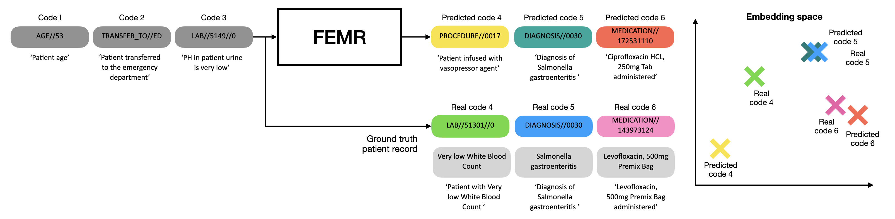

# An Investigation of Memorization Risk in Healthcare Foundation Models (NeurIPS 2025)



---

## Abstract
Foundation models trained on large-scale de-identified electronic health records (EHRs) hold promise for clinical applications. However, their capacity to memorize patient information raises important privacy concerns. In this work, we introduce a suite of black-box evaluation tests to assess privacy-related memorization risks in foundation models trained on structured EHR data. Our framework includes methods for probing memorization at both the embedding and generative levels, and aims to distinguish between model generalization and harmful memorization in clinically relevant settings. We contextualize memorization in terms of its potential to compromise patient privacy, particularly for vulnerable subgroups. We validate our approach on a publicly available EHR foundation model and release an open-source toolkit to facilitate reproducible and collaborative privacy assessments in healthcare AI.

---

## Repository Structure

```

├── embedding_memorization/
│   ├── membership_inference.py     # Implements T4: membership inference attacks
│   └── probing_test.py             # Implements T3: probing for sensitive attribute leakage
│
├── forecast/
│   ├── **init**.py
│   └── ehrmamba2_forecast.ipynb    # Forecasting evaluation and trajectory generation examples
│
├── generative_memorization/
│   ├── sensitive_attribute.py      # Implements T2: sensitive attribute test
│   ├── trajectory_memorization.py  # Implements T1: trajectory reconstruction test
│   └── utils.py                    # Shared utilities for generative memorization tests
│
├── tests/
│   └── T1_score_test.py            # Unit test for similarity metric (dEMD)
│
├── overview.png                    # High-level visual overview of evaluation framework
└── README.md

````

---

## Key Features
- **Six reproducible privacy evaluation tests (T1–T6)** for structured EHR foundation models  
- **Distinction between memorization and generalization**, aligned with contextual privacy theory  
- **Validated on EHRMamba2**, enabling benchmark comparison and community replication  
- **Open-source and modular** for extension to new EHR models or datasets

---

## Authors

**Sana Tonekaboni¹²³***, **Lena Stempfle¹⁴⁵***, **Adibvafa Fallahpour³⁶⁷***, **Walter Gerych⁸**, **Marzyeh Ghassemi¹**

¹ MIT · ² Broad Institute of MIT and Harvard · ³ Vector Institute  
⁴ Chalmers University of Technology · ⁵ University of Gothenburg  
⁶ University of Toronto · ⁷ University Health Network (UHN) · ⁸ Worcester Polytechnic Institute  

\* Equal contribution

---

## Citation
If you use this work, please cite it as follows:

```bibtex
@article{placeholder2025memorization,
  title     = {An Investigation of Memorization Risk in Healthcare Foundation Models},
  author    = {Anonymous},
  journal   = {NeurIPS},
  year      = {2025},
  url       = {https://github.com/...}
}
````

---

**License:** MIT
